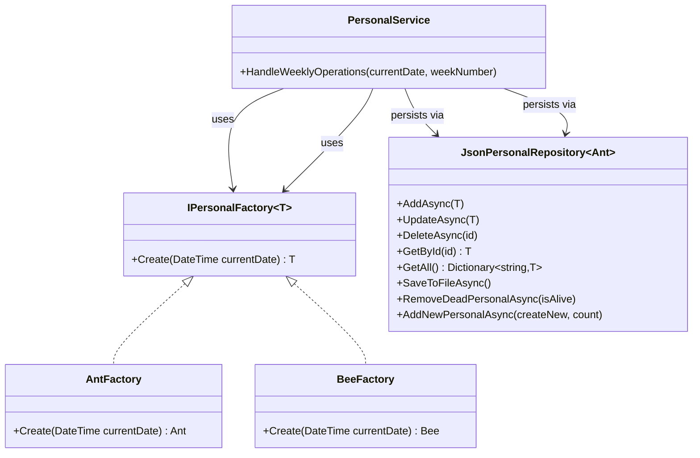

import LightboxImage from "../../app/components/bento/LightboxImage";

<Image
  src="/projects/personnel-register/factory-method-design-pattern.webp"
  alt="csharp"
  width={1000}
  height={378}
  size="lg"
  contained
/>

## Introduction

This case study documents a C# personnel simulation that manages large populations of two species (ants and bees) with distinct lifespans. The design uses **generic Factory Method** to decouple construction, a **generic JSON repository** for persistence, and a **service layer** to orchestrate weekly lifecycle updates (removals and births). The architecture avoids a conventional RDBMS while remaining extensible and maintainable.

---

## System Overview

- **Factory Method (generic):** `IPersonalFactory<T>` defines a single `Create(DateTime)` method. Concrete factories (`AntFactory`, `BeeFactory`) encapsulate species-specific construction by delegating to each type’s creation logic (e.g., `CreateWithRandomBirthDate`).
- **Service Layer:** `PersonalService` coordinates weekly operations across species without knowing construction details or storage specifics.
- **Generic Repository (JSON):** `JsonPersonalRepository<T>` provides CRUD and lifecycle helpers, persisting state to JSON files. The repository expects each entity to expose an `Id` and supports composable operations via delegates.
- **Lifecycle Model:** Species define their own `IsAlive(DateTime)` logic (ants ~14 days, bees ~21 days). Weekly ticks remove those beyond lifespan, then spawn slightly more than died to maintain growth.

---

## Visual Overview

<div className="mt-0 grid overflow-clip rounded-lg md:grid-cols-2">
  <div>
    <LightboxImage
      src="/projects/personnel-register/console-simulation.png"
      alt="Visualization of program run in Rider."
      caption="Program run in Rider."
      className="mx-auto mb-0 w-full max-w-2xl cursor-pointer"
      fullClassName="max-h-[90vh] max-w-[90vw]"
    />
  </div>
  <div>
    <LightboxImage
      src="/projects/personnel-register/simulationandjson.png"
      alt="Program run in Rider with the generated ants.json and bees.json files"
      caption="Program run in Rider with the generated ants.json and bees.json files"
      className="mx-auto mb-0 w-full max-w-2xl cursor-pointer"
      fullClassName="max-h-[90vh] max-w-[90vw]"
    />
  </div>
</div>
<p className="mt-3 text-center text-sm text-gray-500">
  Click any image to view it in full size.
</p>

---

## Architecture Diagram (Mermaid)



---

## Key Code Snippets

### Generic Factory Contract

```csharp showLineNumbers
namespace PersonalRegister
{
    public interface IPersonalFactory<T>
    {
        T Create(DateTime birthDate);
    }
}
```

### Concrete Factories

```csharp showLineNumbers
using PersonalRegister;

namespace PJU
{
    public class AntFactory : IPersonalFactory<Ant>
    {
        public Ant Create(DateTime currentDate)
        {
            // Species-specific construction: random past birth date
            return Ant.CreateWithRandomBirthDate(currentDate);
        }
    }
}
```

```csharp showLineNumbers
using PersonalRegister;

namespace PersonalRegister
{
    public class BeeFactory : IPersonalFactory<Bee>
    {
        public Bee Create(DateTime currentDate)
        {
            return Bee.CreateWithRandomBirthDate(currentDate);
        }
    }
}
```

### Repository Contract

```csharp showLineNumbers
namespace PJU
{
    public interface IRepository<T>
    {
        Task AddAsync(T item);
        Task UpdateAsync(T item);
        Task DeleteAsync(string id);
        T GetById(string id);
        Dictionary<string, T> GetAll();
    }
}
```

### Weekly Lifecycle Orchestration (excerpt)

```csharp showLineNumbers
public async Task HandleWeeklyOperations(DateTime currentDate, int weekNumber)
{
    var antFactory = new AntFactory();
    var beeFactory = new BeeFactory();

    int deadAnts = await _antRepository.RemoveDeadPersonalAsync(a => ((Ant)a).IsAlive(currentDate));
    Console.WriteLine($"{deadAnts} ants died.");
    int antsToBeBorn = (int)(deadAnts * 1.1); // +10%
    if (antsToBeBorn > 0)
    {
        await _antRepository.AddNewPersonalAsync(() => antFactory.Create(currentDate), antsToBeBorn);
        Console.WriteLine($"{antsToBeBorn} new ants were born.");
    }

    int deadBees = await _beeRepository.RemoveDeadPersonalAsync(b => ((Bee)b).IsAlive(currentDate));
    Console.WriteLine($"{deadBees} bees died.");
    int beesToBeBorn = (int)(deadBees * 1.2); // +20%
    if (beesToBeBorn > 0)
    {
        await _beeRepository.AddNewPersonalAsync(() => beeFactory.Create(currentDate), beesToBeBorn);
        Console.WriteLine($"{beesToBeBorn} new bees were born.");
    }

    await SaveSimulationStateAsync(currentDate, weekNumber);
    await _antRepository.SaveToFileAsync();
    await _beeRepository.SaveToFileAsync();
}
```

---

## Process Walkthrough

1. **Load**: Repositories reconstruct in-memory dictionaries from JSON files at startup.
2. **Evaluate**: On each weekly tick, `IsAlive(currentDate)` is applied per species. Those beyond lifespan are removed.
3. **Repopulate**: Factories create new entities based on the number that died and species-specific growth factors.
4. **Persist**: Repositories serialize the updated state and a separate simulation state file records the week/date.
5. **Extend**: Adding a new species involves implementing the species model, its factory, and wiring a repository; the service logic remains unchanged.

---

## Conclusion

The combination of generic Factory Method, a reusable repository abstraction, and a thin orchestration service cleanly separates concerns. Construction varies by species but remains encapsulated; persistence is independent from business rules; and lifecycle logic applies uniformly across types. This keeps the codebase small, extensible, and transparent while supporting large-scale simulations.
